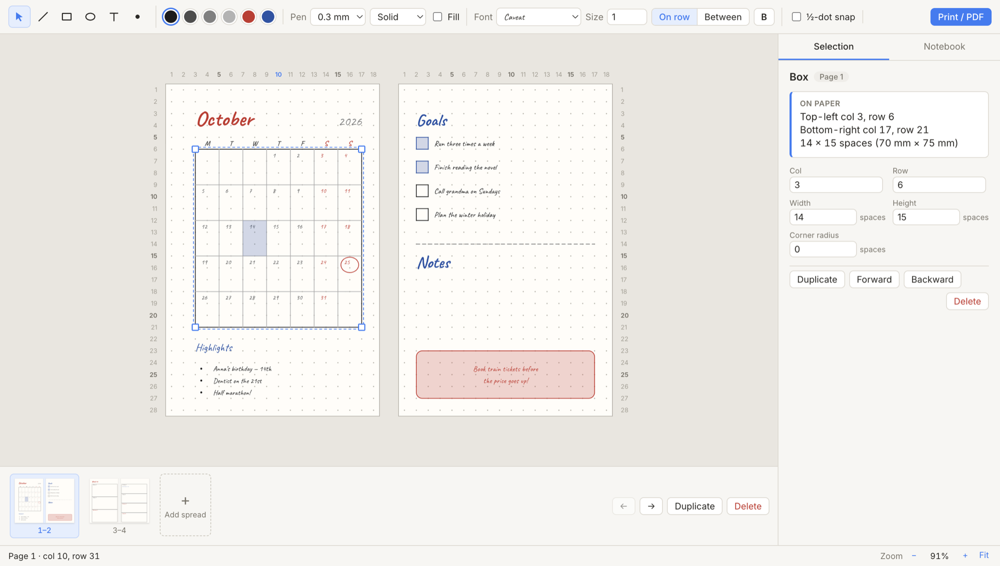
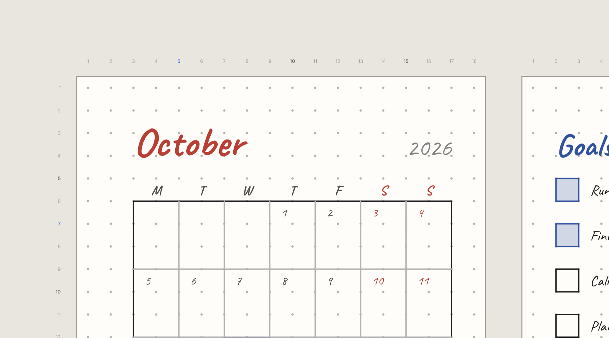
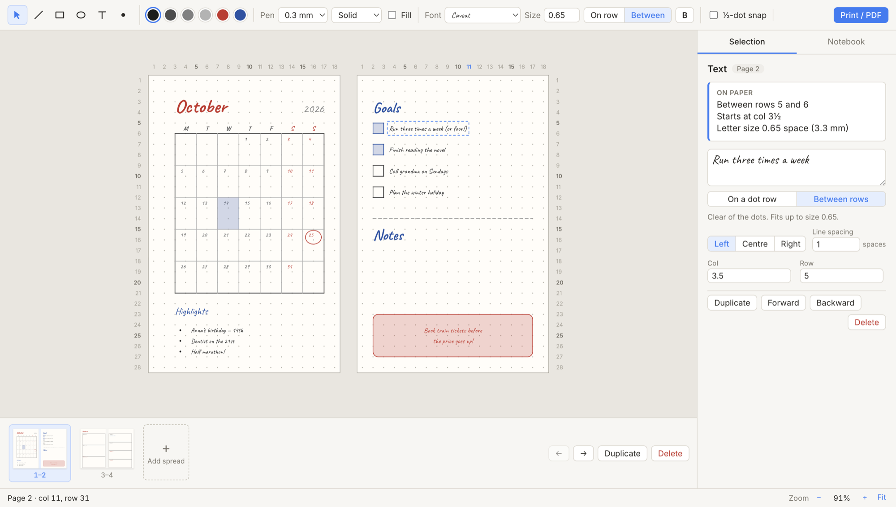
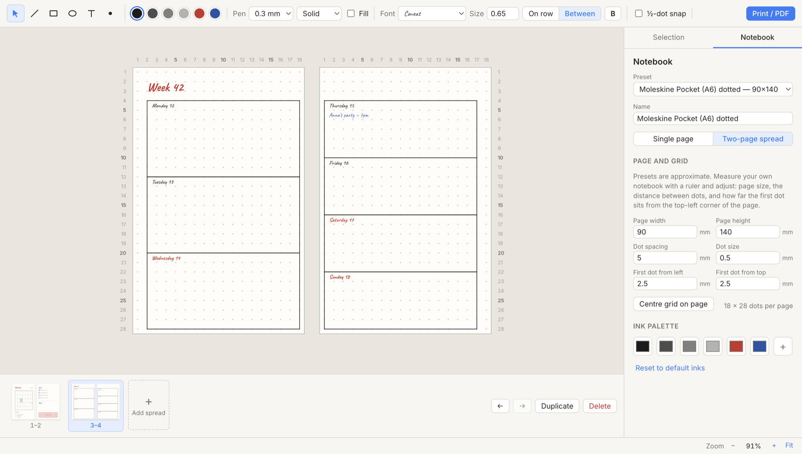
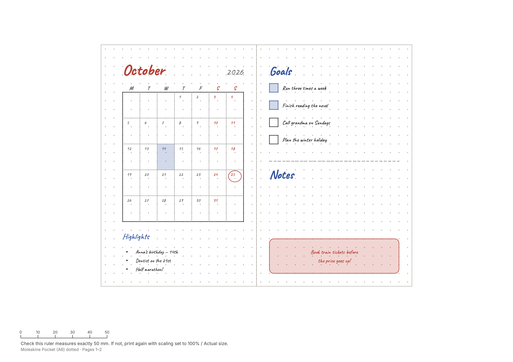

# Notebook Designer

**Design your bullet-journal and planner layouts on a true-to-scale dot grid before you commit them to paper.**

You have a dotted notebook (say an A6 Moleskine) and want to draw a monthly calendar spread with a pen you can't erase. Getting the boxes to fit the page by trial and error on paper is risky. Notebook Designer lets you lay the page out digitally, on the same dot grid as your notebook. It then tells you exactly which dots to start and stop at, so you can copy the design by counting dots.



## Features

- **Your notebook, to scale.** Presets for Moleskine and Leuchtturm1917 dotted notebooks, plus fully custom page size, dot spacing and grid offset. Work on a single page or a two-page spread, with as many spreads as you like.
- **Everything snaps to the dots.** Draw lines, boxes, ellipses, dots/bullets and text. Half-dot snapping is optional, and you can hold <kbd>Alt</kbd> to place things freely.
- **Copy by counting dots.** Dot numbers run along the edges of each page. The *Selection* panel spells out where each element starts and ends, e.g. *"Top-left col 3, row 6 · 14 × 15 spaces (70 × 75 mm)"*.
- **Handwriting fonts.** Caveat, Patrick Hand, Kalam and Shadows Into Light are bundled, so the preview looks like handwriting, and everything works offline.
- **Vertical text.** Turn any label to read downward (like a book spine) or upward, e.g. for habit-tracker columns or a month name down the side of a page. Coordinates and between-the-dots placement work the same way.
- **Text that sits between the rows.** Place text on a dot row, like writing on a ruled line, or centred in the gap between two rows so it never touches the dots. Text is sized to fit automatically.
- **A pen-like palette.** Black, grays, red and blue by default, all editable. Pen widths go from 0.1 to 0.8 mm, solid, dashed or dotted, with light highlighter fills.
- **Fits-on-the-page check.** Anything running off the paper is outlined in red and flagged in the status bar.
- **Print or PDF at 100% scale.** Print on A4 with a 50 mm calibration ruler, or export at the exact notebook page size. Lay the printout next to your notebook to check the fit.

### Built for counting dots

Rulers number every dot. The dot under your cursor is highlighted on both rulers, and the status bar shows the page, column and row.



### Edit text in place

Double-click a label to edit it right on the page, in its final font and size. Double-click another label to switch to it, or triple-click to select all of its text.



### Many pages, any notebook

The page strip under the canvas adds, duplicates, reorders and deletes spreads. Duplicating is handy when one month's layout becomes the template for the next. The *Notebook* tab holds your notebook's measurements and your ink palette.



### True-scale output

*Print / Export PDF* lays your spreads out on A4 with a calibration ruler, or at the exact page size.



## Download

Get the latest version from the **[Releases page](https://github.com/tothda/notebook-designer/releases/latest)**:

| Platform | File |
| --- | --- |
| macOS (Apple Silicon) | `Notebook-Designer-<version>-mac-arm64.dmg` |
| macOS (Intel) | `Notebook-Designer-<version>-mac-x64.dmg` |
| Windows | `Notebook-Designer-<version>-windows-setup.exe` (picks x64 or ARM automatically) |
| Linux | `.AppImage` (any distribution) or `.deb` (Debian/Ubuntu), for x64 and arm64 |

The builds aren't signed with paid developer certificates, so your system will warn you the first time:

- **macOS:** open the `.dmg` and drag the app to Applications. On first launch, macOS says it can't verify the developer. Click **Done**, then open **System Settings › Privacy & Security** and click **Open Anyway** next to *Notebook Designer*.
- **Windows:** if SmartScreen shows *Windows protected your PC*, click **More info › Run anyway**.
- **Linux:** make the AppImage executable (`chmod +x Notebook-Designer-*.AppImage`) and run it, or install the `.deb` with `sudo apt install ./Notebook-Designer-*.deb`.

Double-clicking a `.nbdesign` file opens it in the app.

## Running from source

Requires [Node.js](https://nodejs.org) 20.19+ or 22.12+. Tested on macOS; Electron also runs on Windows and Linux.

```bash
git clone https://github.com/tothda/notebook-designer.git
cd notebook-designer
npm install
npm run dev
```

> With npm 11 or newer, install scripts must be approved. The repository's `package.json` already allows the ones Electron and esbuild need to download their binaries.

To explore, open [`examples/october-2026.nbdesign`](examples/october-2026.nbdesign) with **File → Open**. It contains the monthly and weekly spreads shown above.

## A typical workflow

1. In the **Notebook** tab, pick your notebook. Then measure it with a ruler and adjust the page size, dot spacing and first-dot position if needed.
2. Draw your layout. Use <kbd>⌘D</kbd> to duplicate, then move the copy and press <kbd>⌘D</kbd> again to repeat the same step. A row of seven calendar boxes takes seconds.
3. Check the status bar for anything that runs off the page.
4. Select each element to see its dot coordinates, and copy it onto paper by counting dots. Optionally print it at 100% and hold it against the notebook first.

## Keyboard shortcuts

| Action | Shortcut |
| --- | --- |
| Select / Line / Box / Ellipse / Text / Dot tool | <kbd>V</kbd> <kbd>L</kbd> <kbd>R</kbd> <kbd>O</kbd> <kbd>T</kbd> <kbd>D</kbd> |
| Straight lines, square boxes | hold <kbd>Shift</kbd> while drawing |
| Place freely (no snapping) | hold <kbd>Alt</kbd> |
| Nudge by one dot / five dots | arrow keys / <kbd>Shift</kbd> + arrow keys |
| Duplicate (repeat the last step) | <kbd>⌘D</kbd> |
| Edit text | double-click; triple-click selects all |
| Finish editing / deselect | <kbd>Esc</kbd> |
| Previous / next spread | <kbd>PageUp</kbd> / <kbd>PageDown</kbd> |
| Undo / Redo | <kbd>⌘Z</kbd> / <kbd>⌘⇧Z</kbd> |
| Zoom in / out / fit | <kbd>⌘=</kbd> / <kbd>⌘-</kbd> / <kbd>⌘0</kbd>, or pinch |
| Print / Export PDF | <kbd>⌘P</kbd> |

On Windows and Linux, use <kbd>Ctrl</kbd> in place of <kbd>⌘</kbd>.

## Files

Designs are saved as `.nbdesign` files: plain JSON containing the notebook measurements, pages and elements. The current design is also autosaved and restored when you reopen the app.

## Development

```bash
npm run dev        # run the app with hot reload
npm test           # unit tests (Vitest)
npm run typecheck  # TypeScript
npm run build      # production build into out/
```

### Packaging and releases

```bash
npm run dist:mac     # or dist:win, dist:linux. Installers are written to dist/
```

Releases are built by GitHub Actions on macOS, Windows and Linux runners. To publish one, bump `version` in `package.json`, commit, and push a matching tag:

```bash
git tag v0.2.0
git push origin v0.2.0
```

The [Release workflow](.github/workflows/release.yml) builds every installer and attaches them to a GitHub Release for that tag. Running the workflow manually from the Actions tab builds the installers as downloadable artifacts without publishing a release.

### Architecture

The app is built with Electron, React and TypeScript, bundled with electron-vite, with state in Zustand and undo/redo via zundo. Everything is drawn as SVG in millimetres, so the screen, print and PDF all render from the same code.

| Path | Contents |
| --- | --- |
| `src/shared/` | Design model, dot/mm geometry, page and text-placement logic, file format |
| `src/main/` | Electron main process: menus, file dialogs, autosave, PDF/print |
| `src/renderer/` | React UI: canvas, tools, panels, print layout |

## License

[MIT](LICENSE) © 2026 Dávid Tóth

The bundled fonts are licensed under the [SIL Open Font License](https://openfontlicense.org) and installed from [Fontsource](https://fontsource.org).
